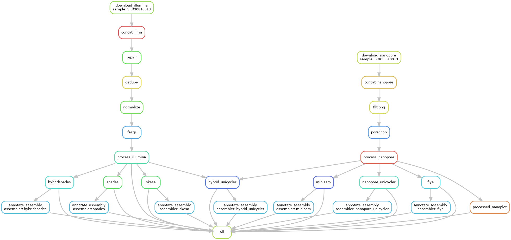

# pteryx

**Version: 0.1.0**




# Plasmidsaurus Submission

```console
docker-compose run --rm pteryx pteryx --ont SRR30810013 --ilmn SRR30805714 
```

# Quick Start

Currently a WIP.
```console
$ make image
$ docker-compose run --rm pteryx pteryx --ilmn tests/fixtures/mesoplasma/mesoplasma_simulated.1.paired.fq.gz

Job stats:
job                   count
------------------  -------
all                       1
biosyntheticspades        1
concat_ilmn               1
dedupe                    1
fastp                     1
normalize                 1
process_illumina          1
repair                    1
skesa                     1
spades                    1
total                    10
```

```console
$ docker-compose run --rm pteryx pteryx --help                              
Creating pteryx_pteryx_run ... done
usage: pteryx [-h] [--outdir OUTDIR] [--targets TARGETS [TARGETS ...]] [-t THREADS]
              [--ilmn ILMN [ILMN ...]] [--ont ONT [ONT ...]] [--canu_correct]
              [--size SIZE] [-n] [--s3] [--force]

Run pteryx

options:
  -h, --help            show this help message and exit
  --outdir OUTDIR, -o OUTDIR
                        Output directory (default: outputs)
  --targets TARGETS [TARGETS ...]
                        target rules (default: ['all'])
  -t THREADS, --threads THREADS
                        Number of cores to use (default: 16)
  --size SIZE           genome size in Mbp. (default: 5M)
  --s3                  Upload to bucket (default: False)
  --force               Force overwrite on S3 (default: False)

NGS sampleIDs shorts and long:
  --ilmn ILMN [ILMN ...]
                        Illumina samples (default: [])
  --ont ONT [ONT ...]   Nanopore samples (default: [])

canu-correct:
  --canu_correct        Whether we should run canu-correct or not (default: False)

debugging:
  -n, --dry-run

```

# how to contribute

Before you spend time working on it, let's make sure that it works. If it doesn't, then strap in.

Clone the repo and run the tests in a Docker container
```console
git clone https://github.com/arudhir/pteryx.git
cd pteryx
make test-ext
```

## Makefile

OG Snakemake. Specify targets and rules to produce targets. 

You can see the list of available targets by typing `make` in a folder with a `Makefile`
```console
➜ make

Usage: make [target]
n.b., add -ext to run target in container

Cleanup:
    clean              clean-build, clean-docs, clean-node, clean-coverage, and clean-pyc
    clean-build        remove build artifacts
    clean-pyc          remove Python file artifacts

Docker image:
    up                 start the service
    image              build the image
    tag                tag the image
    push               push the image to the docker registry
    bash               start a bash shell inside the docker container

Testing:
    test               run fast tests
    test-all           run all tests
```

Adding `-ext` will run inside a container using `docker-compose`. We're using `docker-compose` because it's doing some mounts that we'll find convenient during development:
```console
version: '2'
services:
  pteryx:
    build: .
    image: pteryx
    stdin_open: True
    tty: True
    volumes:
      - ./pteryx/workflow:/pteryx/workflow
      - ./tests:/pteryx/tests
      - ./tests/fixtures/mesoplasma:/pteryx/inputs
      - ./outputs:/pteryx/outputs
```
Why these directories at those locations? And why are we choosing to mount these as runtime instead of copying the contents in when we build the image?

The final `WORKDIR` in the `Dockerfile` is `/pteryx`

* `./pteryx/workflow:/pteryx/workflow`
    * We can immediately execute `snakemake` for quick testing of core workflow without rebuilding -- we can have one window open inside the container and immediately test changes we make locally to the Snakefile and rules
* `./tests:/pteryx/tests`
    * Same logic with `pytest`
* `./tests/fixtures/mesoplasma:/pteryx/inputs`
    * Simulated ILMN and ONT reads from an organism with a small genome in a standard-ish location
        * Badread for ONT
        * ISS for ILMN
* `./outputs:/pteryx/outputs`
    * Connect a local `./outputs` to the default location outputs are put in

# examples

* Run `pytest` in verbose mode; test currently uses `tests/fixtures/huue/config.yml` as the source of sample IDs
```bash
docker-compose run --rm pteryx pytest -v
```

* Run pipeline on local simulated Mesoplasma reads
```bash
docker-compose run --rm pteryx pteryx --ilmn inputs/mesoplasma_simulated.1.paired.fq.gz --ont inputs/mesoplasma_simulated.ont.fq.gz
```

# Genome Assembly General

## Genome Assembly Talk

<redacted>

## Trycycler

https://github.com/rrwick/Trycycler

## Misc

stats.sh from BBMap swaps Nxx and Lxx stats

## TODO
1. add `--version` `-v`
2. proper bumpversion + pypi release
3. make build; make venv
4. update_job_definition immediately after build on `feature` branch for faster batch testing
